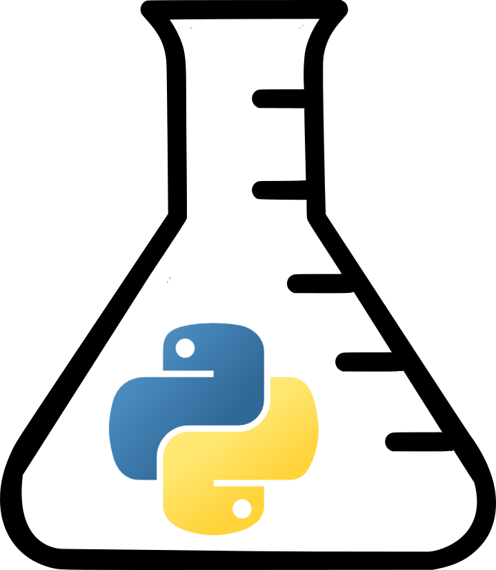

# Python en Ámbitos Científicos

   

Este proyecto es parte del soporte de construcción del libro "Python en Ámbitos Científicos" de Facundo Batista y Manuel Carlevaro.

{:height="200px" width="200px"}

Todavía en desarrollo, aquí se irán publicando capítulos por separado (en distintos grados de finalización) con la idea de poder compartir el contenido y en lo posible ir recibiendo feedback.

Cada capítulo es un PDF diferente, y en el directorio `códigos`, bajo el directorio correspondiente a ese capítulo, estarán los programas en Python que se mencionan o usan en el texto.

Tanto los textos como el código fuente, ejemplos e imágenes son Copyright de Facundo Batista y Manuel Carlevaro y están compartidos bajo la licencia [Creative Commons Atribución-NoComercial-CompartirIgual 4.0 Internacional (CC BY-NC-SA 4.0)](https://creativecommons.org/licenses/by-nc-sa/4.0/deed.es), salvo que se especifique puntualmente lo contrario.
